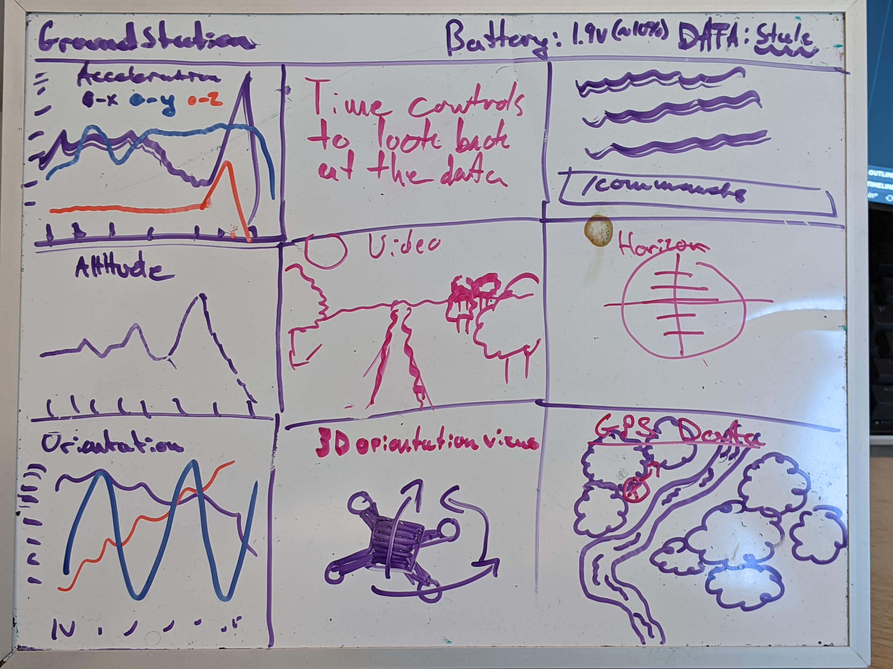
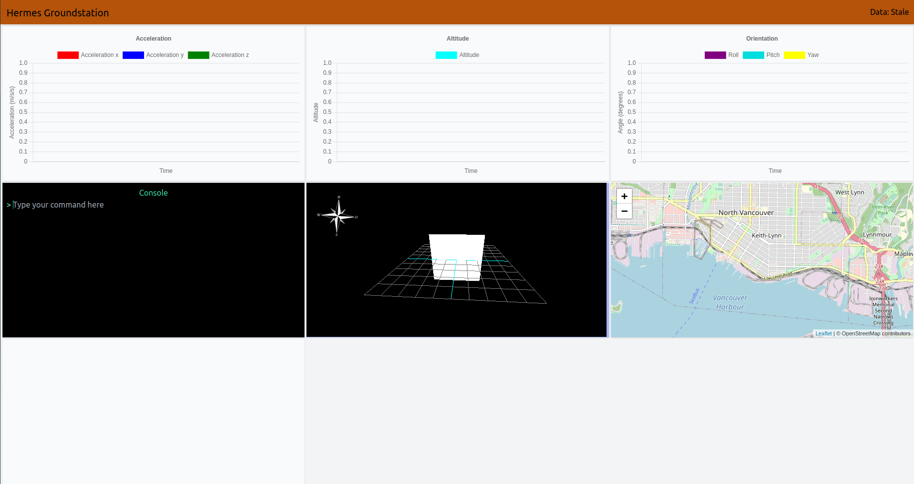

# The groundstation, discovery book, and teensy

Day0 is sort of odd, because I started this project while studying for exams and finishing final projects, basically instead of taking a netflix break I would just work on the groundstation in js. Due to this, there wasn't really a defined goal but mainly me just messing around doing whatever I could in an hour or so here or there.

## The groundstation

Most of the time I spent doing JS stuff on the ground station. To begin I came up with its functionality, based on both what i wanted and other industry grade solutions, then came up with the basic layout and GUI of the system.

As you can probably tell I am not an artist but it lays out what it should look like and gives a key overview for the different functionality.

* on the left we can see the charts showing realtime updates to acceleration, altitude, and orientation
* at the top center we get controls to go back through old data and look for performance and debugging data. This is key for me because in the event I am not able to get real time updates, using the logs from onboard the device allows me to see the flight after.
* Below that is the video the drone is taking, which i still have no clue how to implement and is far down the line
* The orientation viewer is a way for me to better understand the orientation of the drone rather than decypher it from the graph. (side node: it was very tempting to write my own renderer as I have work as a graphics programmer in the past, but three.js is just amazing).
* The command prompt is a way for me to control the drone, so if I want to switch its mode, update sensitivities, or if i want to modify how the groundstation is working, like updating from realtime to loading the data from a file.
* The horizon i have now scraped as I can see it from the orientation viewer
* Lastly the GPS map shows where the drone is and where my computer is relative to each other and helps me better locate the drone in case of a crash. It's also just a cool visual.

## The Stack

Why the web? The gist of it is i'm more comfortable with the web than I am Qt or another GUI environment, and although I could use it as a learning experience to see how they work, I figure the goal of the project is a drone not a groundstation.

To implement this I knew I needed a few things, a chart library, a 3d rendering library, probably a reactive framework, and a map api. For styling, tailwindcss is just a given for me.

### The chart library

Here I choose to go with the first thing I found as it was the most popular on NPM, it was heavily documented, and it looked pretty, [Chart.js]( https://www.chartjs.org/). Fortunately, or unfortunately, there is not much to say about the library as it does exactly what is says it will, which I think is my favorite type of library. I believe I have found one bug with turning animations off but I will look into it more when I have time.

### 3D rendering library

For the orientation viewer and maybe other things in the future I needed a way to renderer 3D visuals. With my previous experience in graphics it was extremely tempting to write it in webgl from scratch but since the goal is the **drone** and not the pretty groundstation I decided to delegate to a library I had used in the past Three.js.

### Map API

For the Map API I was debating between google maps and openstreetmap when I found leaflet.js which walked me through the steps to get up and running and uses Openstreetmap in its tutorial so I have choosen to use it.

### Reactive framework

I initally started out thinking I would use React, Vue or Svelte but quickly realized the entire landscape had changed since I had last used a framework. No longer were create-react-app and vue-cli the "correct" way of doing things, neither was webpack anymore. Frusterated with this insane pace of change, I dropped back to vanilla js and where I need reactivity I use RxJs, which has been a wonder to work with. I basically just use a nodejs backend which monitors a serial port and pushes that through a websocket to the RxJs websocketsubject which each widget subscribes to in order to update their data.

## Overview and current status

The current solution looks like this

As you can see it looks pretty similar to the sketch with some minor changes. First I added a compass to the orientation viewer to better understand where the drone is looking, also the ordering of the widgets are different. This is because in the future I am going to allow the user to drag, drop and resize them to fit their need.

# The discovery book

Probably the thing I should have worked on instead of the groundstation was the discovery book, although I just finished a course in embedded programming and did well in the course, most of it was based around Arduino and using IDEs provided by the microcontroller (MCU) manufacturer. For some reason using I don't feel like I fully understand what is happening when using those tools, and although I have become productive with them the goal of this project is really to learn what going on behind the scenes.

The discovery book was a fantastic start to embedded programming in Rust, with my background, it provided everything I needed to fully understand what was happening each step of the process and have useful challenges (and hints) for doing things like turning on led. Thank you to all who worked on it.

I did however run into some issues with chapter 11, which even with the provided code would not compile. I found the github issue for it and now understand that the book is moving to a new board instead of the stm32f3discovery. I had wished the book was kept in a working state but understand that this is open source and people's free time. I hope in the future I may be able to contribute to it.

Overall, it provided a great platform for me to better understand and further persue embedded programming.

# Teensy 4.0

Other than the stm32f3 I plan on using the teensy along with an xbee radio to relay data to the groundstation but for the current testing phase of getting the onboard (stm32) sensors to work I though using the on board usb. I cannot for the life of me to get it to work, so I have come up with the hackiest of all hacks and used the normal UART to communicate with the teensy and have that forward it through the Arduino Serial library to the computer.

# Conclusion

Honestly these first few days of working of the project give me quite a lot of excitement and I am happy with the progress so far. Sometime after exams I will get started on the onboard sensors and then datapipeline

* write the hack with the teensy
