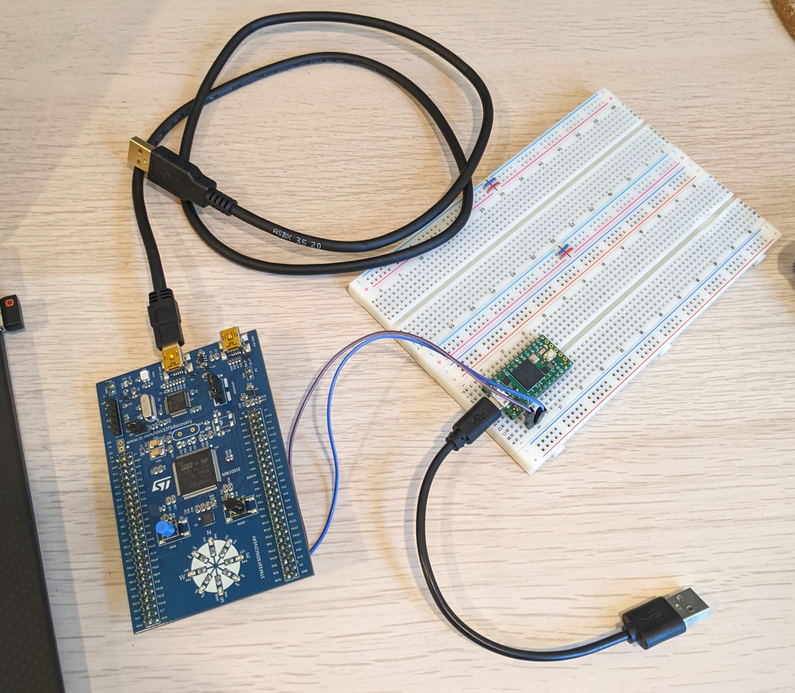

# Getting some form of logging working

Alright, now that I am mostly done with school I can starting working on this project until I start school again in 2 weeks.

**The goal is to get the logging through the USB cable to my computer**

## Step 1 - Getting the logging working

As I mentioned in the last post, I have a rather odd hack to get logging on the STM board. I connect the teensy 4.0 to the usb cable and have it forward UART packets to the computer. Yikes. Let's fix that.

Here is an image of the set up right now.



So I not only dug into the datasheet to attempt to figure this out but also took the st USB training online course (it's free on youtube). Originally I thought I was going to implement USB from scratch, but like normal I have been humbled by the insanity of low level programming. I think I could do it if I had enough time but again the result is the **drone**.


**AAAAAAHHHHHHHHHHHHHH** 

So it turns out, that hack I wrote about isn't a hack at all. It turns out USB is hard and using UART to USB modules is extremely common, all I did was turn a teensy into that module. It also turns out, my board has one built it... so approximated 7 hours later, with a better understanding of USB, I will be erasing all the code I wrote and replacing it with the code I had at the beginning of the day, just a different UART.

**note to self: this trick only works because I have the stlinkv2.1 B and the discovery board revC so if I create my own board I will have to add the module manually or something**

The new code works as I expect and it this entire journey only took 1 day. Now I can move on to getting the on board sensors to work and log the values.

```
insert code for the logging
```

